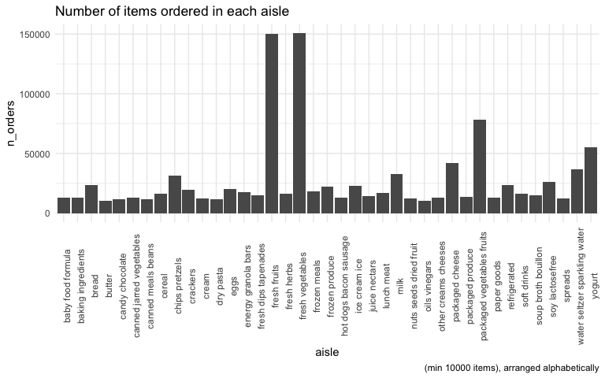
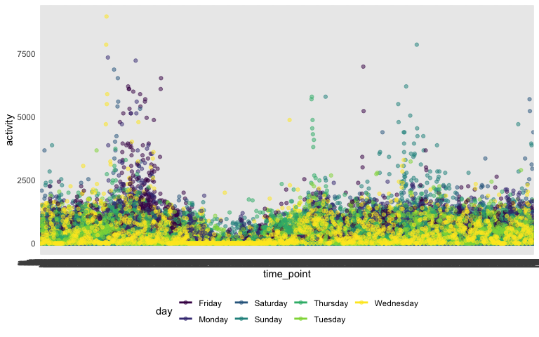

Homework 3
================
RuiJun Chen
10/14/2019

## Problem 1

``` r
library(p8105.datasets)
data("instacart")
```

The Instacart dataset shows that there are a total of 1384617
observations/rows across 131209 unique orders placed on Instacart. Each
observation or row represents an item order, and there are 15 variables
or columns which include order\_id, product\_id, add\_to\_cart\_order,
reordered, user\_id, eval\_set, order\_number, order\_dow,
order\_hour\_of\_day, days\_since\_prior\_order, product\_name,
aisle\_id, department\_id, aisle, department. These variables include
information on when the items were ordered, which user ordered it, how
often it has been reordered, along with information on the item itself
such as the name or department/aisle it is in. There are 21 unique
departments from alcohol to snacks. There are a total of 39123 unique
products available, with orders placed between the hours of 0 and 23

``` r
instacart %>% 
  group_by(aisle) %>% 
  summarize(n_orders = n()) %>% 
  arrange(desc(n_orders))
```

    ## # A tibble: 134 x 2
    ##    aisle                         n_orders
    ##    <chr>                            <int>
    ##  1 fresh vegetables                150609
    ##  2 fresh fruits                    150473
    ##  3 packaged vegetables fruits       78493
    ##  4 yogurt                           55240
    ##  5 packaged cheese                  41699
    ##  6 water seltzer sparkling water    36617
    ##  7 milk                             32644
    ##  8 chips pretzels                   31269
    ##  9 soy lactosefree                  26240
    ## 10 bread                            23635
    ## # … with 124 more rows

There are a total of 134 aisles and fresh vegetables and fresh fruits,
respectively, are the top 2 aisles which have the most items ordered
from them.

``` r
instacart %>% 
  group_by(aisle) %>% 
  summarize(n_orders = n()) %>% 
  filter(n_orders > 10000) %>% 
  ggplot(aes(x = aisle, y = n_orders)) +
  geom_col() +
  labs(title = "Number of items ordered in each aisle", caption = "(min 10000 items), arranged alphabetically") +
  theme(axis.text.x = element_text(angle=90))
```



Table of 3 most popular items in aisles “baking ingredients”, “dog food
care”, and “packaged vegetables fruits”

``` r
instacart %>% 
  filter(aisle == 'baking ingredients' | aisle == "dog food care" | aisle == "packaged vegetables fruits") %>% 
  group_by(aisle, product_name) %>% 
  summarize(n_orders = n()) %>% 
  arrange(desc(n_orders)) %>% 
  mutate(rank = rank(desc(n_orders))) %>% 
  filter(rank <= 3) %>% 
  knitr::kable()
```

| aisle                      | product\_name                                 | n\_orders | rank |
| :------------------------- | :-------------------------------------------- | --------: | ---: |
| packaged vegetables fruits | Organic Baby Spinach                          |      9784 |    1 |
| packaged vegetables fruits | Organic Raspberries                           |      5546 |    2 |
| packaged vegetables fruits | Organic Blueberries                           |      4966 |    3 |
| baking ingredients         | Light Brown Sugar                             |       499 |    1 |
| baking ingredients         | Pure Baking Soda                              |       387 |    2 |
| baking ingredients         | Cane Sugar                                    |       336 |    3 |
| dog food care              | Snack Sticks Chicken & Rice Recipe Dog Treats |        30 |    1 |
| dog food care              | Organix Chicken & Brown Rice Recipe           |        28 |    2 |
| dog food care              | Small Dog Biscuits                            |        26 |    3 |

``` r
instacart %>% 
  filter(product_name == "Pink Lady Apples" | product_name == "Coffee Ice Cream") %>% 
  group_by(product_name, order_dow) %>% 
  summarize(mean_hour_of_day = mean(order_hour_of_day)) %>% 
  pivot_wider(
    names_from = order_dow,
    values_from = mean_hour_of_day
  ) %>% 
  knitr::kable()
```

| product\_name    |        0 |        1 |        2 |        3 |        4 |        5 |        6 |
| :--------------- | -------: | -------: | -------: | -------: | -------: | -------: | -------: |
| Coffee Ice Cream | 13.77419 | 14.31579 | 15.38095 | 15.31818 | 15.21739 | 12.26316 | 13.83333 |
| Pink Lady Apples | 13.44118 | 11.36000 | 11.70213 | 14.25000 | 11.55172 | 12.78431 | 11.93750 |

## Problem 2

Cleaning the data to format variable names, focus on “Overall Health”,
including only “Excellent” to “Poor” responses, and organizing as
factors ordered from “Poor” to “Excellent”

``` r
data("brfss_smart2010")
brfss_smart2010 = 
  brfss_smart2010 %>% 
  janitor::clean_names() %>% 
  filter(topic == "Overall Health" & 
           (response == "Excellent" | response == "Very good" |
              response == "Good" | response == "Fair" | response == "Poor")) %>% 
  mutate(
    response = factor(response),
    response = fct_relevel(response, "Poor", "Fair", "Good", "Very good")
  )

brfss_smart2010 
```

    ## # A tibble: 10,625 x 23
    ##     year locationabbr locationdesc class topic question response
    ##    <int> <chr>        <chr>        <chr> <chr> <chr>    <fct>   
    ##  1  2010 AL           AL - Jeffer… Heal… Over… How is … Excelle…
    ##  2  2010 AL           AL - Jeffer… Heal… Over… How is … Very go…
    ##  3  2010 AL           AL - Jeffer… Heal… Over… How is … Good    
    ##  4  2010 AL           AL - Jeffer… Heal… Over… How is … Fair    
    ##  5  2010 AL           AL - Jeffer… Heal… Over… How is … Poor    
    ##  6  2010 AL           AL - Mobile… Heal… Over… How is … Excelle…
    ##  7  2010 AL           AL - Mobile… Heal… Over… How is … Very go…
    ##  8  2010 AL           AL - Mobile… Heal… Over… How is … Good    
    ##  9  2010 AL           AL - Mobile… Heal… Over… How is … Fair    
    ## 10  2010 AL           AL - Mobile… Heal… Over… How is … Poor    
    ## # … with 10,615 more rows, and 16 more variables: sample_size <int>,
    ## #   data_value <dbl>, confidence_limit_low <dbl>,
    ## #   confidence_limit_high <dbl>, display_order <int>,
    ## #   data_value_unit <chr>, data_value_type <chr>,
    ## #   data_value_footnote_symbol <chr>, data_value_footnote <chr>,
    ## #   data_source <chr>, class_id <chr>, topic_id <chr>, location_id <chr>,
    ## #   question_id <chr>, respid <chr>, geo_location <chr>

In 2002, which states were observed at 7 or more locations? What about
in 2010?

``` r
brfss_smart2010 %>% 
  filter(year == 2002) %>% 
  group_by(locationabbr, locationdesc) %>% 
  summarize(n = n_distinct(locationdesc)) %>% 
  count(locationabbr) %>% 
  filter(n >= 7)
```

    ## # A tibble: 6 x 2
    ## # Groups:   locationabbr [6]
    ##   locationabbr     n
    ##   <chr>        <int>
    ## 1 CT               7
    ## 2 FL               7
    ## 3 MA               8
    ## 4 NC               7
    ## 5 NJ               8
    ## 6 PA              10

In 2002, CT, FL, MA, NC, NJ, and PA were observed at 7 or more locations

``` r
brfss_smart2010 %>% 
  filter(year == 2010) %>% 
  group_by(locationabbr, locationdesc) %>% 
  summarize(n = n_distinct(locationdesc)) %>% 
  count(locationabbr) %>% 
  filter(n >= 7)
```

    ## # A tibble: 14 x 2
    ## # Groups:   locationabbr [14]
    ##    locationabbr     n
    ##    <chr>        <int>
    ##  1 CA              12
    ##  2 CO               7
    ##  3 FL              41
    ##  4 MA               9
    ##  5 MD              12
    ##  6 NC              12
    ##  7 NE              10
    ##  8 NJ              19
    ##  9 NY               9
    ## 10 OH               8
    ## 11 PA               7
    ## 12 SC               7
    ## 13 TX              16
    ## 14 WA              10

In 2010, CA, CO, FL, MA, MD, NC, NE, NJ, NY, OH, PA, SC, TX, WA were
observed at 7 or more locations

Making spaghetti plot of average value over time within a state

``` r
brfss_smart2010 %>% 
  filter(response == "Excellent") %>% 
  select(year, locationabbr, response, data_value) %>% 
  group_by(year, locationabbr) %>% 
  summarize(mean_data_value = mean(data_value)) %>% 
  ggplot(aes(x = year, y = mean_data_value, color = locationabbr)) + 
  geom_line(aes(group = locationabbr)) +
  labs(title = "Average data value for each state over time", colour = "State")
```


Making two-panel plot for 2006 and 2010 with distribution of data\_value
for responses among locations in NY state

``` r
brfss_smart2010 %>% 
  filter(locationabbr == "NY" & (year == 2006 | year == 2010)) %>% 
  ggplot(aes(x = response, y = data_value)) + 
  geom_point() +
  facet_grid(~year)
```


## Problem 3

``` r
accel_data = 
  read_csv("./data/accel_data.csv") %>% 
  janitor::clean_names() %>% 
  mutate(
    weekday_v_weekend = case_when(
      (day == "Saturday" | day == "Sunday") ~ "weekend",
      TRUE ~ "weekday"
    )
  )
```

    ## Parsed with column specification:
    ## cols(
    ##   .default = col_double(),
    ##   day = col_character()
    ## )

    ## See spec(...) for full column specifications.

In the accelerometer dataset, there are a total of total of 35 rows/day
where each row represents a day of activities/accelerometer data. There
is information on the week, day, day of the week, along with data on
activities for each minute of the day, for a total of 1440 activities,
and a total of 1444 variables, with the addition of the weekday vs
weekend variable.

``` r
accel_data %>% 
  mutate(
    sum = rowSums(select(accel_data, starts_with("activity")))
    ) %>% 
  select(week, day_id, day, weekday_v_weekend, sum) %>% 
  knitr::kable()
```

| week | day\_id | day       | weekday\_v\_weekend |       sum |
| ---: | ------: | :-------- | :------------------ | --------: |
|    1 |       1 | Friday    | weekday             | 480542.62 |
|    1 |       2 | Monday    | weekday             |  78828.07 |
|    1 |       3 | Saturday  | weekend             | 376254.00 |
|    1 |       4 | Sunday    | weekend             | 631105.00 |
|    1 |       5 | Thursday  | weekday             | 355923.64 |
|    1 |       6 | Tuesday   | weekday             | 307094.24 |
|    1 |       7 | Wednesday | weekday             | 340115.01 |
|    2 |       8 | Friday    | weekday             | 568839.00 |
|    2 |       9 | Monday    | weekday             | 295431.00 |
|    2 |      10 | Saturday  | weekend             | 607175.00 |
|    2 |      11 | Sunday    | weekend             | 422018.00 |
|    2 |      12 | Thursday  | weekday             | 474048.00 |
|    2 |      13 | Tuesday   | weekday             | 423245.00 |
|    2 |      14 | Wednesday | weekday             | 440962.00 |
|    3 |      15 | Friday    | weekday             | 467420.00 |
|    3 |      16 | Monday    | weekday             | 685910.00 |
|    3 |      17 | Saturday  | weekend             | 382928.00 |
|    3 |      18 | Sunday    | weekend             | 467052.00 |
|    3 |      19 | Thursday  | weekday             | 371230.00 |
|    3 |      20 | Tuesday   | weekday             | 381507.00 |
|    3 |      21 | Wednesday | weekday             | 468869.00 |
|    4 |      22 | Friday    | weekday             | 154049.00 |
|    4 |      23 | Monday    | weekday             | 409450.00 |
|    4 |      24 | Saturday  | weekend             |   1440.00 |
|    4 |      25 | Sunday    | weekend             | 260617.00 |
|    4 |      26 | Thursday  | weekday             | 340291.00 |
|    4 |      27 | Tuesday   | weekday             | 319568.00 |
|    4 |      28 | Wednesday | weekday             | 434460.00 |
|    5 |      29 | Friday    | weekday             | 620860.00 |
|    5 |      30 | Monday    | weekday             | 389080.00 |
|    5 |      31 | Saturday  | weekend             |   1440.00 |
|    5 |      32 | Sunday    | weekend             | 138421.00 |
|    5 |      33 | Thursday  | weekday             | 549658.00 |
|    5 |      34 | Tuesday   | weekday             | 367824.00 |
|    5 |      35 | Wednesday | weekday             | 445366.00 |

There appear to be some days, usually on weekends, when the total
activity is very low or no data is tracked. For example, there are two
Saturdays with a total of 1440, which essentially represents the
baseline of 1 for every minute so likely no activity was tracked or the
patient was sedentary for the entire day (but unlikely to have
absolutely no activity).

``` r
accel_data %>% 
  pivot_longer(
    activity_1:activity_1440,
    names_to = "time_point",
    values_to = "activity"
  ) %>% 
  ggplot(aes(x = time_point, y = activity, color = day)) +
  geom_point(alpha = .5) + 
  geom_smooth(se = FALSE)
```

    ## `geom_smooth()` using method = 'loess' and formula 'y ~ x'


There appear to be a dip in activity in the early-middle part of each
day, along with a spike in activity soon before this period in the
morning, which is the time of the day with the most activity and the
most peaks. There is another region of higher activity in what might be
the late afternoon/early evening.
